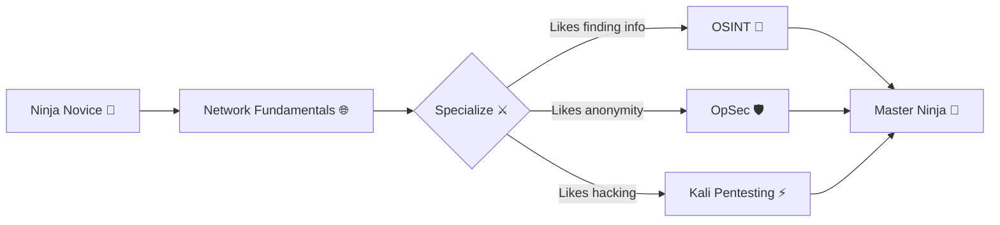

<div align="center">

```
██╗   ██╗███╗   ██╗███████╗ ██████╗ 
╚██╗ ██╔╝████╗  ██║██╔════╝██╔═══██╗
 ╚████╔╝ ██╔██╗ ██║█████╗  ██║   ██║
  ╚██╔╝  ██║╚██╗██║██╔══╝  ██║   ██║
   ██║   ██║ ╚████║███████╗╚██████╔╝
   ╚═╝   ╚═╝  ╚═══╝╚══════╝ ╚═════╝ 
```

# 🥷 YNEO · Digital Shadow Ninja

*"I operate in the darkness of the net, where data whispers secrets."* 🌙

[](docs/OSINT.md)
[](docs/OPSEC.md)
[](docs/KALI.md)
[](docs/CHEATSHEETS.md)


</div>

---

## 🌙 Who I am

> Cyberspace shinobi. Information gatherer (**OSINT**), guardian of anonymity (**OpSec**) and master of the art of penetration testing with **Kali Linux**.

This profile is a **treasure chest of knowledge**: the most complete documentation of the most used and useful **OSINT**, **OpSec** and **Kali Linux** tools — explained step by step so anyone, from beginner to ninja, can learn and master the art.

```text
🎯 Goal:    Share offensive & defensive cybersecurity knowledge
🛠️  Tools:  Kali Linux | OSINT | OpSec | Pentesting
🎨 Style:   Anime Black ⚫ + Neon 💜
```

---

## 📚 The Documentation (your arsenal)

| 🥷 Category | 🗂️ File | 📖 Contents |
|---|---|---|
| **OSINT** (Open Source Intelligence) | [`docs/OSINT.md`](docs/OSINT.md) | Maltego, theHarvester, Sherlock, Maigret, Recon-ng, SpiderFoot, Shodan, PhoneInfoga, Holehe, ExifTool, Metagoofil, dmitry, Amass, Sublist3r, WhatWeb and more |
| **OpSec** (Operational Security) | [`docs/OPSEC.md`](docs/OPSEC.md) | Tor, Tails, Whonix, ProxyChains, Nipe, macchanger, KeePassXC, VeraCrypt, GPG, MAT, BleachBit, secure-delete and more |
| **Kali Linux** (the hacker's swiss army knife) | [`docs/KALI.md`](docs/KALI.md) | Nmap, Metasploit, Burp Suite, Wireshark, John the Ripper, Hashcat, Hydra, sqlmap, Aircrack-ng, Responder, BloodHound and more |
| **Quick Cheatsheets** | [`docs/CHEATSHEETS.md`](docs/CHEATSHEETS.md) | Essential commands at a glance, by category |

> 👉 **Start here:** [`docs/README.md`](docs/README.md) — Arsenal navigation guide.

---

## ⚡ Ninja Stats

<div align="center">


</div>

---

## 🛠️ Tools & Technologies

```text
OSINT        █████████████████████████░  Deep reconnaissance
OpSec        ████████████████████░░░░░░  Anonymity & privacy
Pentesting   ████████████████████████░░  Penetration testing
Networking   ██████████████████░░░░░░░░  TCP/IP networks
Bash / Linux ██████████████████████░░░░  Scripting & automation
```

---

## 🧭 Learning paths



---

## ⚠️ Code of Honor (Ethical Disclaimer)

> **The information in this repository is for educational and research purposes only.**
> Using these tools against systems you don't own, **without written authorization**, is **illegal** in most countries and can land you in prison.
>
> A true ninja wields their power with **responsibility**, **ethics** and **respect for the law**. 🥷

```text
✅ Only systems you own or have explicit permission to test
✅ Only learning and legitimate defense
✅ Never use this knowledge to harm
```

---

<div align="center">

**© 2026 YNEO · Made with 💜, ☕ and lots of Kali Linux**

```text
 🥷 「寝ずの番」 — The night never sleeps...
```

</div>