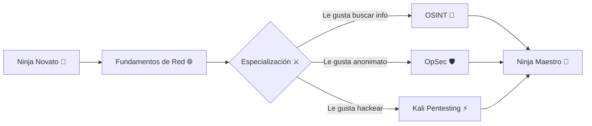

<div align="center">

```
██╗   ██╗███╗   ██╗███████╗ ██████╗ 
╚██╗ ██╔╝████╗  ██║██╔════╝██╔═══██╗
 ╚████╔╝ ██╔██╗ ██║█████╗  ██║   ██║
  ╚██╔╝  ██║╚██╗██║██╔══╝  ██║   ██║
   ██║   ██║ ╚████║███████╗╚██████╔╝
   ╚═╝   ╚═╝  ╚═══╝╚══════╝ ╚═════╝ 
```

# 🥷 YNEO · El Ninja de las Sombras Digitales

*"Opero en la oscuridad de la red, donde los datos susurran secretos."* 🌙

[](docs/OSINT.md)
[](docs/OPSEC.md)
[](docs/KALI.md)
[](docs/CHEATSHEETS.md)


</div>

---

## 🌙 Quién soy

> Shinobi del ciberespacio. Recolector de información (**OSINT**), guardián del anonimato (**OpSec**) y maestro del arte del pentesting con **Kali Linux**.

Este perfil es un **cofre del conocimiento**: la documentación más completa, en **español**, de las herramientas más usadas y útiles de **OSINT**, **OpSec** y **Kali Linux**, explicadas paso a paso para que cualquiera —del novato al ninja— pueda aprender y dominar el arte.

```text
🎯 Objetivo: Compartir conocimiento de ciberseguridad ofensiva y defensiva
🛠️  Armas: Kali Linux | OSINT | OpSec | Pentesting
🎨 Estilo: Anime Black ⚫ + Neón 💜
```

---

## 📚 La Documentación (tu arsenal)

| 🥷 Categoría | 🗂️ Archivo | 📖 Contenido |
|---|---|---|
| **OSINT** (Inteligencia de fuentes abiertas) | [`docs/OSINT.md`](docs/OSINT.md) | Maltego, Maltego CE, theHarvester, Sherlock, Maigret, Recon-ng, SpiderFoot, Shodan, PhoneInfoga, Holehe, ExifTool, Metagoofil, dmitry, Amass, sublist3r, WhatWeb y más |
| **OpSec** (Seguridad operacional) | [`docs/OPSEC.md`](docs/OPSEC.md) | Tor, Tails, Whonix, ProxyChains, Nipe, macchanger, KeePassXC, VeraCrypt, GPG, MAT, BleachBit, secure-delete y más |
| **Kali Linux** (La navaja suiza del hacker) | [`docs/KALI.md`](docs/KALI.md) | Nmap, Metasploit, Burp Suite, Wireshark, John the Ripper, Hashcat, Hydra, sqlmap, Aircrack-ng, Responder, BloodHound y más |
| **Cheatsheets rápidas** | [`docs/CHEATSHEETS.md`](docs/CHEATSHEETS.md) | Comandos esenciales de un vistazo por categoría |

> 👉 **Empieza por aquí:** [`docs/README.md`](docs/README.md) — Guía de navegación del arsenal.

---

## ⚡ Estadísticas del Ninja

<div align="center">


</div>

---

## 🛠️ Herramientas y Tecnologías

```text
OSINT        █████████████████████████░  Reconocimiento profundo
OpSec        ████████████████████░░░░░░  Anonimato y privacidad
Pentesting   ████████████████████████░░  Pruebas de penetración
Networking   ██████████████████░░░░░░░░  Redes TCP/IP
Bash / Linux ██████████████████████░░░░  Scripting y automatización
```

---

## 🧭 Rutas de aprendizaje



---

## ⚠️ Código de Honor (Disclaimer ético)

> **La información de este repositorio es solo con fines educativos y de investigación.**
> Usar estas herramientas contra sistemas que no te pertenecen, **sin autorización por escrito**, es **ilegal** en la mayoría de países y puede llevarte a prisión.
>
> Un verdadero ninja usa su poder con **responsabilidad**, **ética** y **respeto por la ley**. 🥷

```text
✅ Solo sistemas propios o con permiso explícito
✅ Solo aprendizaje y defensa legítima
✅ Jamás usamos el conocimiento para dañar
```

---

<div align="center">

**© 2026 YNEO · Hecho con 💜, ☕ y mucho Kali Linux**

```text
 🥷 「寝ずの番」 — La noche nunca duerme...
```

</div>